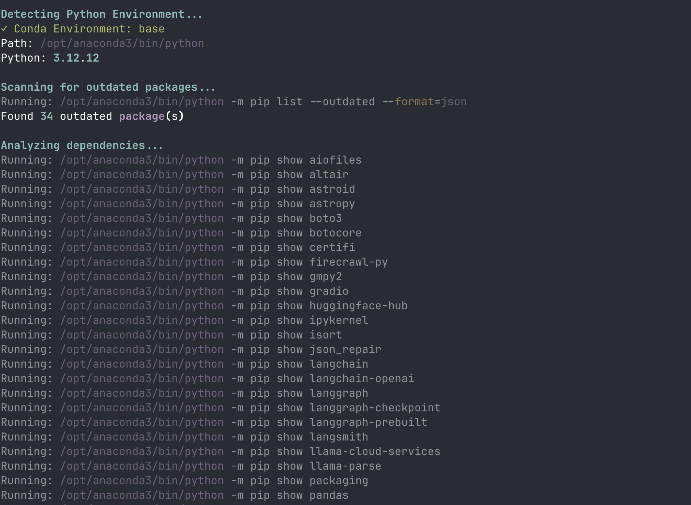
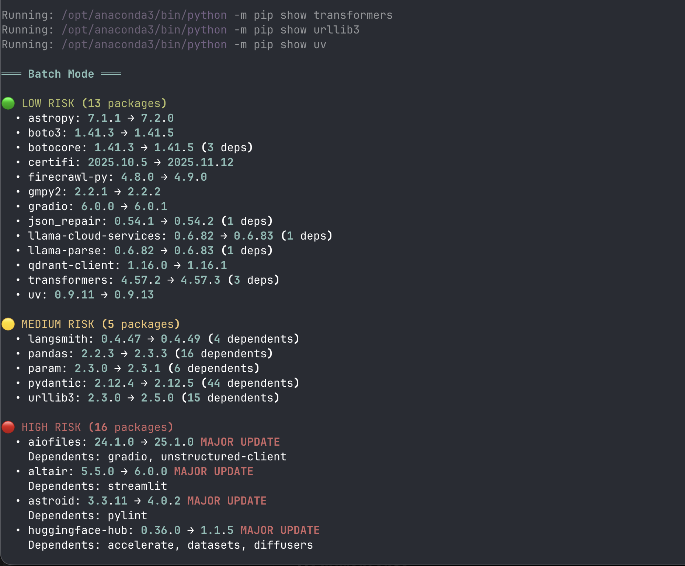
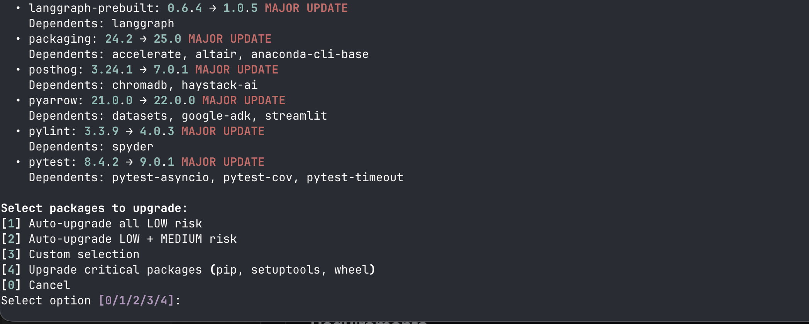

# pip Package Guardian


Safe Python package upgrades with intelligent risk assessment and rollback capability.

**Script:** `safe_pip_upgrade.py` - Because package upgrades shouldn't be scary.


## ⚠️ Important Disclaimer

**READ [DISCLAIMER.md](DISCLAIMER.md) BEFORE USING**

This tool modifies your Python packages. While designed with extensive safety features, always backup your work and test after upgrades.

## Features

- ✅ **Smart Risk Assessment** - Automatically classifies updates as Low/Medium/High/Critical risk
- ✅ **Dependency Analysis** - Shows which packages depend on what before upgrading
- ✅ **Environment Protection** - Detects and protects system Python from modification
- ✅ **Pre-Upgrade Snapshots** - Creates requirements.txt backup before any changes
- ✅ **Rollback Scripts** - Automatic shell script generation for one-command rollback
- ✅ **Import Verification** - Tests each package after upgrade to ensure it works
- ✅ **Batch Mode** - Review all packages, select which to upgrade
- ✅ **Beautiful UI** - Color-coded risk levels with rich formatting (optional)
- ✅ **Comprehensive Logging** - All actions logged to `~/pip-upgrade-logs/`

## Screenshots

### Environment Detection

*Automatically detects and validates your Python environment (venv, conda, homebrew, or system)*

### Risk Assessment

*Intelligent risk classification with color-coded categories and dependency analysis*

### Upgrade Options

*Flexible upgrade strategies from conservative to comprehensive*

## Quick Start

### Installation

```bash
# Clone or download
git clone <your-repo-url> pip-package-guardian
cd pip-package-guardian

# Optional but recommended: Install rich for better UI
pip install rich
```

### Run

```bash
# In your Python environment (venv/conda)
python safe_pip_upgrade.py
# or
./safe_pip_upgrade.py
```

## How It Works

### 1. Environment Detection

The script automatically detects your Python environment:

```
✓ Virtual Environment: myenv
✓ Conda Environment: base
⚠ Homebrew Global Python
✗ System Python (PROTECTED)
```

**Safety:** System Python is never modified to prevent breaking macOS.

### 2. Package Scanning

Scans for outdated packages and classifies by risk:

```
🟢 LOW RISK (5 packages)
  • requests: 2.31.0 → 2.31.1
  • certifi: 2023.5.7 → 2023.7.22

🟡 MEDIUM RISK (3 packages)
  • pytest: 7.4.0 → 7.5.0 (2 dependents)
  • numpy: 1.24.3 → 1.25.2 (3 dependents)

🔴 HIGH RISK (2 packages)
  • django: 4.2.0 → 5.0.0 MAJOR UPDATE
    Dependents: app1, app2, plugin-x

⚙️ CRITICAL PACKAGES (1 package)
  • pip: 23.2.1 → 24.0
```

### 3. Risk Classification

| Risk Level | Criteria | Action |
|------------|----------|--------|
| 🟢 **LOW** | Patch updates (x.x.Z), no dependents | Safe to auto-upgrade |
| 🟡 **MEDIUM** | Minor updates (x.Y.x), has dependents | Requires review |
| 🔴 **HIGH** | Major updates (X.x.x), breaking changes | Manual confirmation |
| ⚙️ **CRITICAL** | pip, setuptools, wheel | Special handling |

### 4. Upgrade Options

```
[1] Auto-upgrade all LOW risk
[2] Auto-upgrade LOW + MEDIUM risk
[3] Custom selection
[4] Upgrade critical packages (pip, setuptools, wheel)
[0] Cancel
```

### 5. Safety Backups

Before any upgrade:
```
Creating safety snapshot...
  ✓ Snapshot: ~/pip-upgrade-logs/requirements_20251106_123045.txt
  ✓ Rollback script: ~/pip-upgrade-logs/rollback_20251106_123045.sh
```

### 6. Verification

After each upgrade:
```
Upgrading packages...
  Upgrading requests...
  ✓ requests upgraded successfully
  Upgrading pytest...
  ✓ pytest upgraded successfully
```

## Risk Assessment Details

### LOW RISK 🟢
- **Patch updates** (1.2.3 → 1.2.4)
- **No packages depend on it**
- **Same major.minor version**
- **Typically safe** for immediate upgrade

**Example:** Bug fixes, security patches

### MEDIUM RISK 🟡
- **Minor version change** (1.2.x → 1.3.0)
- **Has dependents** but version ranges compatible
- **New features** added, backwards compatible
- **Review recommended** before upgrading

**Example:** New APIs added, deprecation warnings

### HIGH RISK 🔴
- **Major version change** (1.x.x → 2.0.0)
- **Breaking changes** expected
- **Many packages** depend on it with tight pins
- **Requires testing** after upgrade

**Example:** API changes, removed features

### CRITICAL ⚙️
- **pip, setuptools, wheel**
- **Core Python infrastructure**
- **Upgrade last** to avoid breaking mid-upgrade
- **Test immediately** after upgrade

## Rollback

If something breaks after an upgrade:

### Quick Rollback
```bash
# Use the generated script
bash ~/pip-upgrade-logs/rollback_20251106_123045.sh
```

### Manual Rollback
```bash
# Restore from requirements snapshot
pip install -r ~/pip-upgrade-logs/requirements_20251106_123045.txt
```

### Find Your Rollback Files
```bash
ls -lt ~/pip-upgrade-logs/ | head -10
```

## Environment Support

### ✅ Supported Environments
- **Virtual Environments** (venv) - Recommended
- **Conda Environments** - Fully supported
- **Homebrew Global Python** - Supported with warnings

### ❌ Not Supported
- **macOS System Python** - Protected (will not modify)
- **Unknown installations** - Safety check prevents modification

### Switching Environments

Run the script in the environment you want to upgrade:

```bash
# Activate your environment first
source myenv/bin/activate  # venv
conda activate myenv       # conda

# Then run the script
python safe_pip_upgrade.py
```

## Logs and Snapshots

All files saved to `~/pip-upgrade-logs/`:

```
~/pip-upgrade-logs/
├── upgrade_20251106_123045.log            # Detailed command log
├── requirements_20251106_123045.txt       # Pre-upgrade snapshot
└── rollback_20251106_123045.sh           # Rollback script
```

## Security Features

1. **No Shell Injection** - Uses list arguments in subprocess (no `shell=True`)
2. **Package Name Sanitization** - Validates all package names
3. **Input Validation** - All user inputs validated
4. **Timeout Protection** - 5-minute timeout on all commands
5. **Safe File Operations** - Proper error handling and encoding
6. **System Python Protection** - Never modifies macOS system Python
7. **Secure File Permissions** - Rollback scripts set to user-only (0o700)
8. **Enhanced Error Handling** - Catches all import exceptions including side effects
9. **Zero External Dependencies** - Only standard library (rich is optional)

## Usage Examples

### Example 1: Safe Routine Maintenance
```bash
./safe_pip_upgrade.py
# Select option [1] - Auto-upgrade all LOW risk
# Review the list, confirm
# Done in < 1 minute
```

### Example 2: Review Before Major Changes
```bash
./safe_pip_upgrade.py
# See that django 4.2 → 5.0 is available (HIGH RISK)
# Select option [0] - Cancel
# Review django 5.0 changelog first
# Test in development environment
# Come back later with informed decision
```

### Example 3: Custom Selection
```bash
./safe_pip_upgrade.py
# Select option [3] - Custom selection
# Enter: requests, certifi, urllib3
# Only these packages upgraded
```

## Troubleshooting

### "Cannot modify this Python environment"
You're trying to upgrade system Python. Create a virtual environment:
```bash
python3 -m venv myenv
source myenv/bin/activate
pip install -r requirements.txt
python safe_pip_upgrade.py
```

### "rich library not found"
Install for better UI (optional):
```bash
pip install rich
```

### Import verification fails
Some packages have different import names. This is usually okay - the package is upgraded, just can't auto-verify. Test manually:
```python
import your_package
```

### Rollback didn't work
Check the log file for errors:
```bash
tail -50 ~/pip-upgrade-logs/upgrade_TIMESTAMP.log
```

Manually reinstall from snapshot:
```bash
pip install -r ~/pip-upgrade-logs/requirements_TIMESTAMP.txt --force-reinstall
```

## Best Practices

### ✅ DO
- **Run in virtual environments** whenever possible
- **Backup your work** before upgrading
- **Test after upgrading** especially HIGH RISK packages
- **Keep rollback scripts** for at least 30 days
- **Review HIGH RISK** packages in staging first
- **Upgrade regularly** to stay current with security patches

### ❌ DON'T
- **Don't upgrade right before deployment**
- **Don't auto-upgrade HIGH RISK** without testing
- **Don't ignore dependency warnings**
- **Don't delete rollback scripts immediately**
- **Don't upgrade system Python** (script prevents this)
- **Don't skip testing** after MAJOR version changes

## Future Enhancements (Not in MVP)

The current version is a **Minimum Viable Product** with core safety features. Future versions may include:

- [ ] Interactive mode (one-by-one package review)
- [ ] Profile mode (save/reuse upgrade decisions)
- [ ] PyPI metadata (descriptions, download stats, last update dates)
- [ ] Security vulnerability checking
- [ ] Test suite execution after upgrades
- [ ] Multiple environment scanning from one command
- [ ] Upgrade scheduling and reminders

## Requirements

- Python 3.7+
- pip (comes with Python)
- macOS or Linux
- Optional: `rich` library for enhanced UI

## License

MIT License - Free to use and modify

See [LICENSE](LICENSE) file for details.

## Disclaimer

This software is provided "as-is" without warranty. See [DISCLAIMER.md](DISCLAIMER.md) for full details.

**Always backup your work before running package upgrades.**

## Contributing

This is a personal tool but suggestions welcome! Areas for improvement:
- Additional package managers (poetry, pipenv)
- Windows support
- More sophisticated dependency conflict detection
- Integration with requirements.txt/pyproject.toml

---

**Remember:** With great automation comes great responsibility. Always review what you're upgrading! 🛡️
